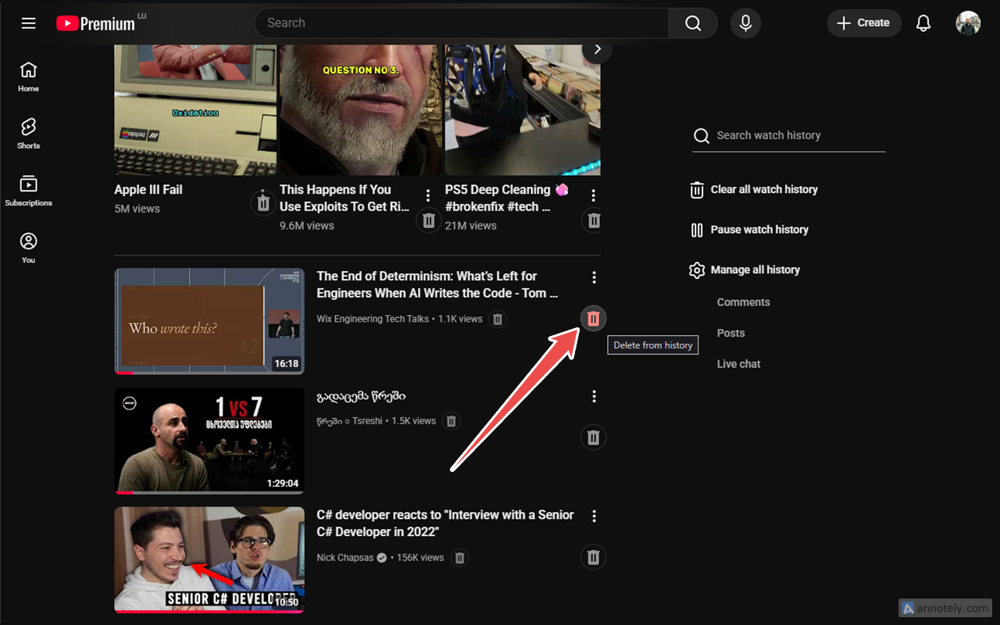
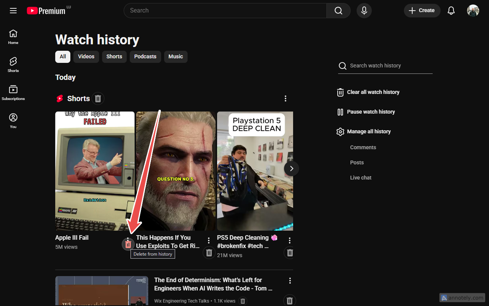
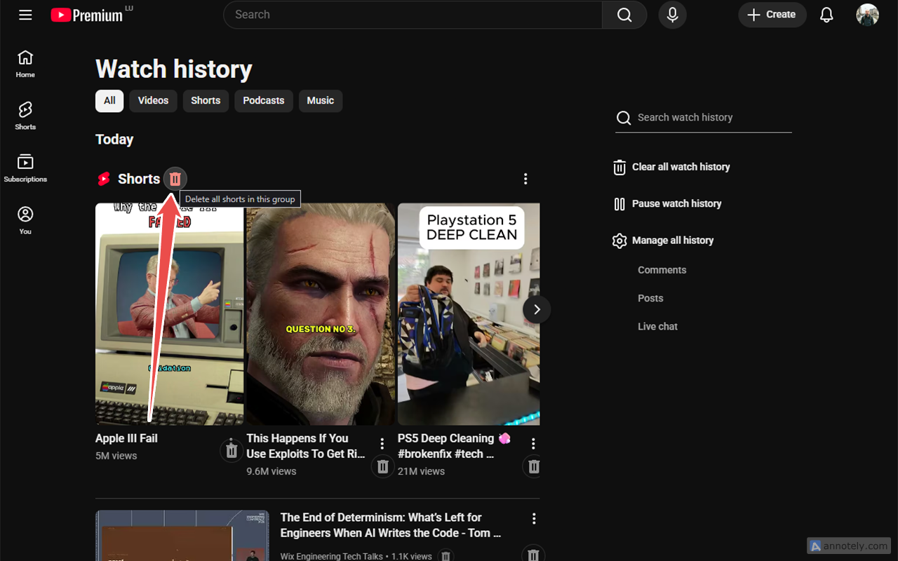
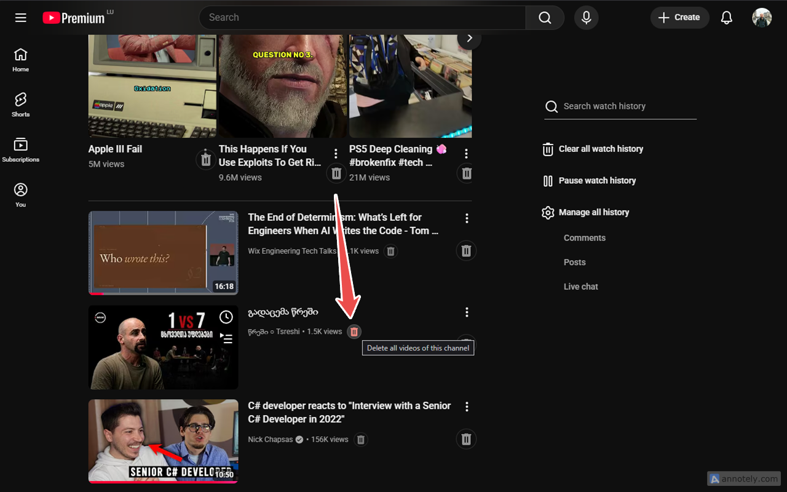
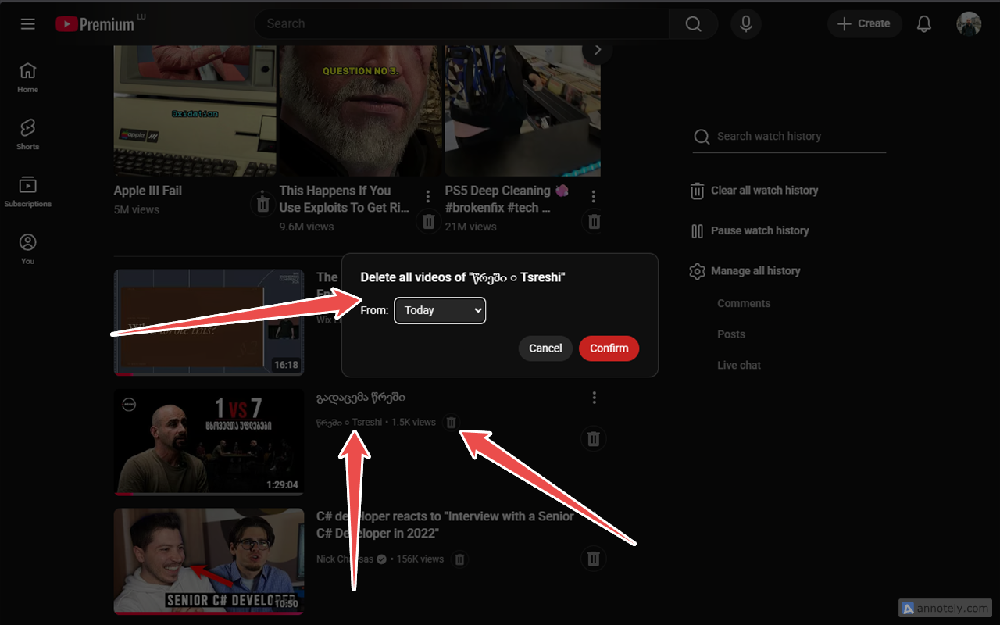

# YouTube History Cleanup

Keeps your YouTube watch history tidy so your recommendations stay clean.

[](https://chromewebstore.google.com/detail/youtube-history-cleanup/oocmbcdepmcghanimefeadoniopbnjbb)
[](LICENSE)

## Why

One stray click on a junk video and YouTube's recommendations are wrecked for days. The algorithm doesn't forget. To keep your feed clean you have to keep your watch history clean — and YouTube makes that needlessly painful: every delete is a hover, then a three-dot menu, then a click on "Remove from watch history".

This extension fixes that.

## What it does

- **Always-visible delete button** on every video row and every short — no hover dance
- **Delete all from this channel** — wipes every item from a given creator in one click, with confirmation
- **Delete all shorts in this group** — clears an entire shorts shelf at once
- **SPA-aware** — activates when you navigate to History via the sidebar, no reload required
- Works on items appended as you scroll (continuation payloads)

## Install

[Chrome Web Store](https://chromewebstore.google.com/detail/youtube-history-cleanup/oocmbcdepmcghanimefeadoniopbnjbb)

Or load unpacked from `dist/` after `npm install && npm run build`.

## Screenshots

| | |
|---|---|
|  |  |
|  |  |
|  | |

## How it works

Reads each history item's `feedbackToken` from the page (the same token YouTube's own UI uses) and sends a signed `POST` to `https://www.youtube.com/youtubei/v1/feedback` — the official delete endpoint. Same API, same auth, same result, just without the clicks.

For lazy-loaded items, the extension wraps `window.fetch` in the page realm and harvests new tokens from `/youtubei/v1/browse` continuation responses as you scroll.

See [`CONTEXT.md`](CONTEXT.md) for the glossary of terms used in the code and docs.

## Privacy

- No accounts, no analytics, no telemetry, no remote servers
- No data is collected, stored, or transmitted to any third party
- The only network traffic is the delete request sent directly to youtube.com on your behalf
- No `chrome.storage`, no `localStorage`, no cookies, no persistence

Full policy: [`docs/privacy.md`](docs/privacy.md)

## Permissions

- Host permission for `https://www.youtube.com/*` — required to call the delete endpoint and to detect SPA navigation to `/feed/history`. The extension only modifies the DOM on the history page.

## Development

```bash
npm install
npm run build       # bundle into dist/
npm run watch       # rebuild on change
npm run typecheck
npm test            # unit tests (vitest)
npm run test:e2e    # end-to-end (playwright)
```

Load `dist/` as an unpacked extension in `chrome://extensions`.

## Limitations

- Only the watch history page is supported. Search history, comment history, and other Google activity are unaffected.
- YouTube can change its DOM or endpoint at any time and break the extension. Updates ship as breakage is discovered — please file an issue if you spot one.

## Contributing

Issues and feature requests welcome at [github.com/themidnightgospel/yt-history-cleanup/issues](https://github.com/themidnightgospel/yt-history-cleanup/issues).

## License

MIT — see [LICENSE](LICENSE).

Icon and attribution: see [`ATTRIBUTION.md`](ATTRIBUTION.md).
